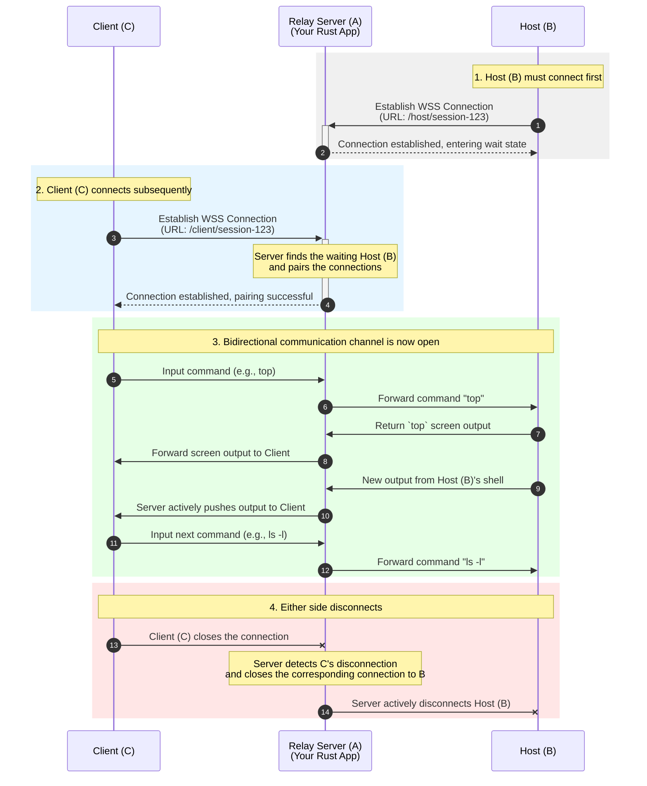

```mermaid
sequenceDiagram
    participant C as Client (C)
    participant A as Relay Server (A)<br/>(Your Rust App)
    participant B as Host (B)

    autonumber

    rect rgb(240, 240, 240)
        note over B: 1. Host (B) must connect first
        B->>+A: Establish WSS Connection<br/>(URL: /host/session-123)
        A-->>-B: Connection established, entering wait state
    end

    rect rgb(230, 245, 255)
        note over C: 2. Client (C) connects subsequently
        C->>+A: Establish WSS Connection<br/>(URL: /client/session-123)
        note over A: Server finds the waiting Host (B)<br/>and pairs the connections
        A-->>-C: Connection established, pairing successful
    end

    rect rgb(230, 255, 230)
        note over C, B: 3. Bidirectional communication channel is now open
        C->>A: Input command (e.g., top)
        A->>B: Forward command "top"
        B->>A: Return `top` screen output
        A->>C: Forward screen output to Client

        B->>A: New output from Host (B)'s shell
        A->>C: Server actively pushes output to Client

        C->>A: Input next command (e.g., ls -l)
        A->>B: Forward command "ls -l"
    end

    rect rgb(255, 230, 230)
        note over C, B: 4. Either side disconnects
        C-x A: Client (C) closes the connection
        note over A: Server detects C's disconnection<br/>and closes the corresponding connection to B
        A-x B: Server actively disconnects Host (B)
    end
```
